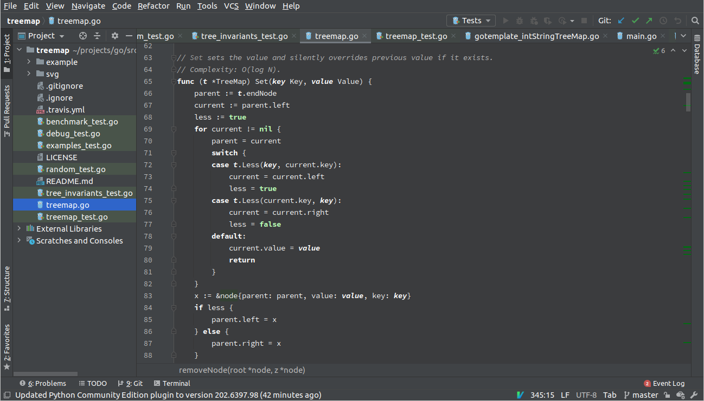

&ensp;Helsing
======================================================================

This is a dark color theme for JetBrains products for working under the sunlight.
It is designed to be visible even in enormously bright environment.

Installation
------------

Open __Settings__ of your IDE and install the plugin from __Plugins__ dialog.
Or install it from here https://plugins.jetbrains.com/plugin/12553-helsing.

Tips for working on plain air
-----------------------------

1. Wear dark.
   Your screen will reflect your bright clothes.
   Even a matte display won't help if the sun will be shining on your white T-shirt.
2. Try to find a shadow.
   But try to not use trees.
   A lot of trees produce tiny drops of a resin.
   They are hard to clean from your screen.
3. Set the brightness level to the maximum.
4. Have a cleaning cloth with you. A dust is very distracting in the sun.
5. Try [garlic](https://github.com/igrmk/garlic) theme for GNOME Terminal and [hull](https://github.com/igrmk/kull-vim) theme for Vim.

Thanks to
---------

